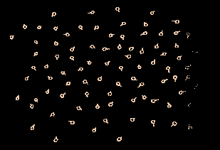

<h1 align="center">👋 Olá! Prazer, sou o Marcelo </h1>

             

# 💫 Sobre mim
## 🌎 Minha história:

- Nascido em 1981;
- Graduado em Turismo em 2006; 
- Graduando em Ciências Econômicas;
- Já atuei em projetos e planejamento de Turismo, bem como empresário na área de hotelaria;
- Ex-servidor público como fiscal no Conselho Regional de Odontologia do RS.

## 💾 Paixão por programação:
- Primeiros "programas" em arquivos .bat em MS-DOS, configurando seleção de execução de programas e diretórios através de menus, mudança de cor de fontes, etc.
- 2º grau em Técnico de Processamento de Dados, utilizando "DataFlex" em 1998;
- Entusiasta por Banco de Dados e programação voltadas ao comércio, hotelaria e manipulação de dados econômicos;

## 📈 Transição de carreira e evolução:
- Atualmente trade no Mercado Financeiro Internacional;
- Retomando paixão por programação e realizando cursos na DIO.me;
- Procuro evoluir e ser o meu melhor sempre!

## 💻 Objetivos:
- Data Science;
- Banco de Dados;
- Programação Python.

# 🚧  Buscando conhecimento:
    
          
          

### 📫 &nbsp; Como falar comigo:

 &nbsp;
 &nbsp;
 &nbsp;

<!-- # 📊 GitHub Stats: -->
<!--   -->
<!--   -->
<!--   -->

<!--  -->

<!-- ## 🏆 GitHub Trophies

  -->

